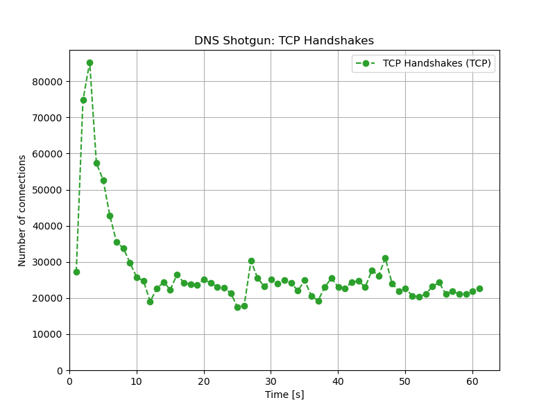

# DNS Shotgun

Realistic DNS benchmarking tool which supports multiple transport protocols:

  - **DNS-over-TLS (DoT)**
  - **DNS-over-HTTPS (DoH)**
  - UDP
  - TCP

*DNS Shotgun is capable of simulating hundreds of thousands of DoT/DoH
clients.*

Every client establishes its own connection(s) when communicating over
TCP-based protocol. This makes the tool uniquely suited for realistic DoT/DoH
benchmarks since its traffic patterns are very similar to real clients.

DNS Shotgun exports a number of statistics, such as query latencies, number of
handshakes and connections, response rate, response codes etc. in JSON format.
The toolchain also provides scripts that can plot these into readable charts.

## Features

- Supports DNS over UDP, TCP, TLS and HTTP/2
- Allows mixed-protocol simultaneous benchmark/testing
- Can bind to multiple source IP addresses
- Customizable client behaviour (idle time, TLS versions, HTTP method, ...)
- Replays captured queries over selected protocol(s) while keeping original timing
- Suitable for high-performance realistic benchmarks
- Tools to plot charts from output data to evaluate results

## Caveats

- Requires captured traffic from clients
- Setup for proper benchmarks can be quite complex
- Isn't suitable for testing with very low number of clients/queries
- Backward compatibility between versions isn't kept

## Documentation

**The latest documentation can be found at <https://dns-shotgun.readthedocs.io/>.**

For installation and/or build instructions, see the
[Installation section](https://dns-shotgun.readthedocs.io/en/stable/installation/)
of the documentation. The same section also contains instructions for building
the documentation itself.

## Showcase

The following charts highlight the unique capabilities of DNS Shotgun.
Measurements are demonstrated using DNS over TCP.  In our test setup, DNS
Shotgun was able to keep sending/receiving:

- 400k queries per second over
- **500k simultaneously active TCP connections**, with about
- 25k handshakes per second, which amounts to
- 1.6M total established connections during the 60s test runtime.




### Socket statistics on server

```
# ss -s
Total: 498799 (kernel 0)
TCP:   498678 (estab 498466, closed 52, orphaned 0, synrecv 0, timewait 54/0), ports 0

Transport Total     IP        IPv6
*        0         -         -
RAW      4         1         3
UDP      19        2         17
TCP      498626    5         498621
INET     498649    8         498641
FRAG     0         0         0
```

### Test setup

- DNS over TCP against [TCP echo server](https://gitlab.nic.cz/knot/echo-server)
- two physical servers: one for DNS Shotgun, another for the echo server
- both servers have 16 CPUs, 32 GB RAM, 10GbE network card (up to 64 queues)
- servers were connected directly to each other - no latency
- TCP network stack was tuned and there was no firewall

## License

DNS Shotgun is released under GPLv3 or later.

## Thanks

We'd like to thank the [Comcast Innovation
Fund](https://innovationfund.comcast.com) for sponsoring the work to support
the use of TCP, DoT and DoH protocols.

DNS Shogun is built of top of the [dnsjit](https://github.com/DNS-OARC/dnsjit)
engine. We'd like to thank DNS-OARC and Jerry Lundström for the development and
continued support of dnsjit.
