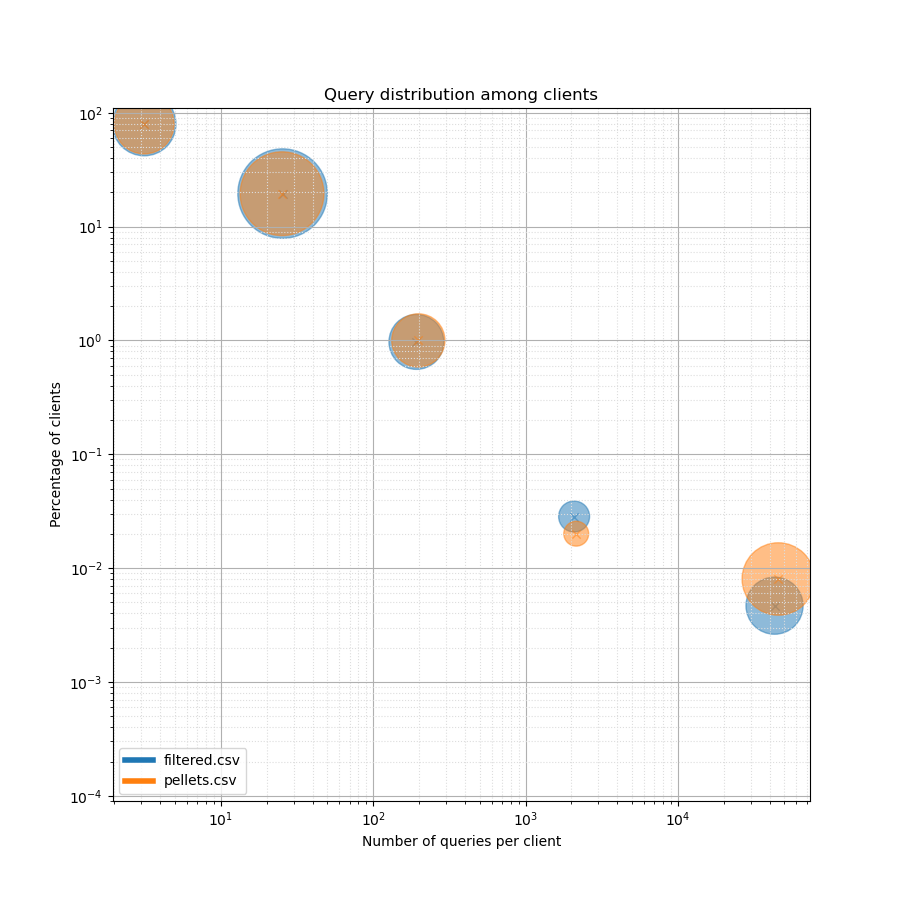

# Analyzing Clients

When you've created a pellets file that is ready to use for DNS Shotgun replay,
you may want to verify you didn't distort the original client population. There
is a tool that can be used to compare client distribution and activity between
the original traffic capture and the pellets file.

!!! note
    This steps is optional and may not be neccessary for larger client
    populations or for client populations with similar behaviour. Nevertheless,
    it's better to check your assumptions.

First, you need to run client analysis script for both the original capture (or
rather the `filtered.pcap` file) and the processed pellets file.

```
$ pcap/count-packets-per-ip.lua -r filtered.pcap --csv filtered.csv
$ pcap/count-packets-per-ip.lua -r pellets.pcap --csv pellets.csv
```

Then, you can use another tool to plot a chart of these results.

```
$ tools/plot-client-distribution.py -o clients.png filtered.csv pellets.csv
```

## Client distribution chart

The following charts demonstrates how queries are distributed among clients. It
can be used to read how active are your clients or how many overall queries
your resolver receives from which clients.

!!! warning
    The following chart displays absolute number of queries, not QPS. When
    comparing multiple distributions, always make sure to use PCAPs of the same
    duration.



There are several blobs on the chart that represent groups of clients. The area
of the blob visually signifies the total amount of queries that were received
from these clients.

For each blob, you can locate its center and read the X and Y axes values.
Please note that both axis are logarithmic. On the Y-axis you can read the mean
number of queries that a client represented in the blob has sent. On the
X-axis, you can read the percentage of clients that are represented by this
blob.

In the example above, the first blob from the left shows that almost 80 % of
clients send less than 10 queries. Around 20 % of clients send between 10 and
100 queries. Even though the remaining clients represent around 1 % of the
total client population, we can see that these clients generate significant
query traffic.

The comparison shows the two samples are quite similar. In case these
differences are significant, you may want to consider changes to pellets files.
If you used `pcap/limit-clients.lua` to generate these, using a different
`-s/--seed` might help.
