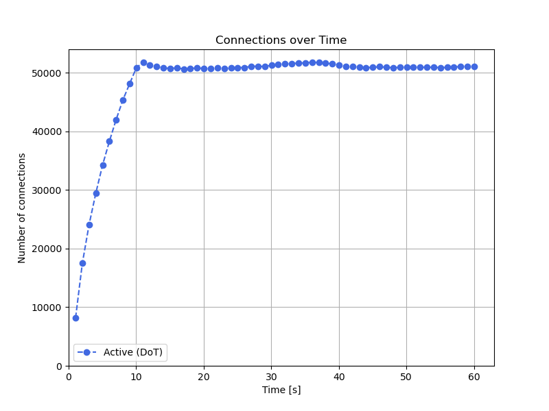
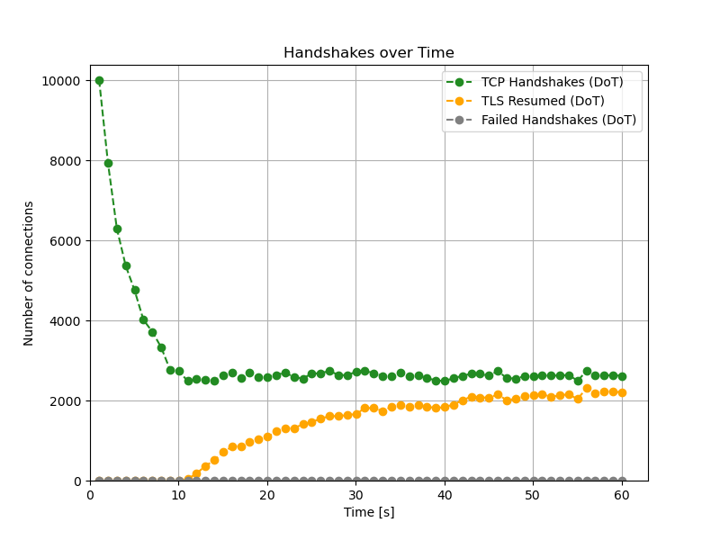

# Connection Chart

The connection chart can be used to visualize connection-related information,
such as the number of active established connections, handshake attempts,
successful TLS Session Resumptions or failed handshakes.

```
$ tools/plot-connections.py -k active -- DoT.json
$ tools/plot-connections.py -k conn_hs tls_resumed failed_hs -t "Handshakes over Time" DoT.json
```

The optional parameter `-k/--kind` can be used to select which data should be
plotted. The following values are supported.

- `active` means the number of currently active established connections
- `conn_hs` means the number of TCP or QUIC handshake attempts in the last second
- `failed_hs` means the number of failed handshakes. All kinds of connection
  setup failures will be included, whether it's TCP handshake timeout, TLS
  negotiation failure or anything else.
- `tls_resumed` means the number of connection that were resumed with TLS
  Session Resumption during the last second

!!! tip
    Using the `--` to separate a list of JSON files after specifying
    `-k/--kind` might be needed in some cases.



