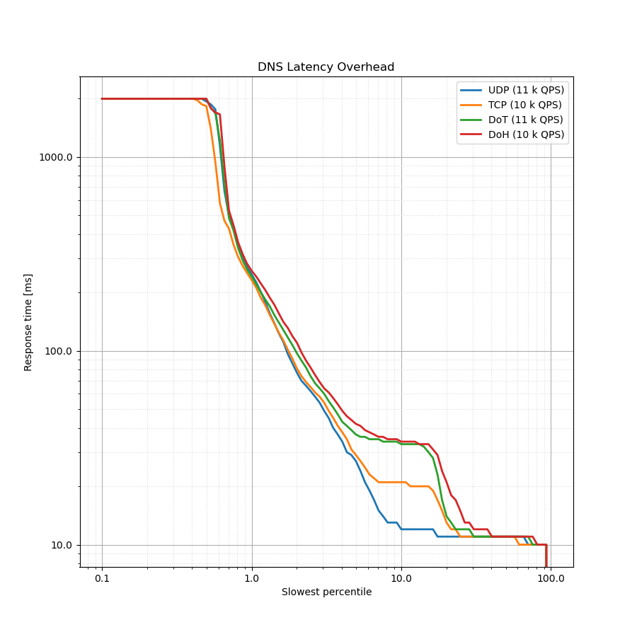

# Latency Histogram

This very useful chart is a bit difficult to read and understand, but it
provides a great deal of information about the overall latency from client side
perspective. We use the logarithmic percentile histogram to display this data.
[This
article](https://blog.powerdns.com/2017/11/02/dns-performance-metrics-the-logarithmic-percentile-histogram/)
provides an in-depth explanation about the chart and how to interpret it.

```
$ tools/plot-latency.py -t "DNS Latency Overhead" UDP.json TCP.json DoT.json DoH.json
```



The chart above illustrates why comparing just the response rate isn't a
sufficient metric. For all protocols compared in this case, you'd get around
99.5 % response rate. However, when you examine the client latency, you can see
clear differences.

In the chart, 80 % of all queries are represented by the rightmost part of the
chart - between the "slowest percentile" of 20 % and 100 %. For these
queries, the latency for UDP, TCP, DoT or DoH is the same, which is one
round trip. These represent immediate answers from the resolver (e.g. cached or
refused), which are sent either over UDP or over an already established
connection (for stateful protocols). The latency is 10 ms, or 1 RTT.

The most interesting part is between the 5 % and 20 % slowest percentile. For
these 15 % of all queries, there are major differences between the latency of
UDP, TCP and DoT/DoH. This illustrates the latency cost of setting up a
connection where none is present. UDP is stateless and requires just 1 RTT. TCP
requires an extra round trip to establish the connection and the latency for the
client becomes 2 RTTs. Finally, both DoT and DoH require an additional round
trip for the TLS handshake and thus the overall latency cost becomes 3 RTTs.

The trailing 5 % of queries show no difference between protocols, since these
are queries that aren't answered from cache and the delay is introduced by the
communication between the resolver and the upstream servers. The last 0.5 % of
queries aren't answered by the resolver within 2 seconds and are considered a
timeout by the client.
