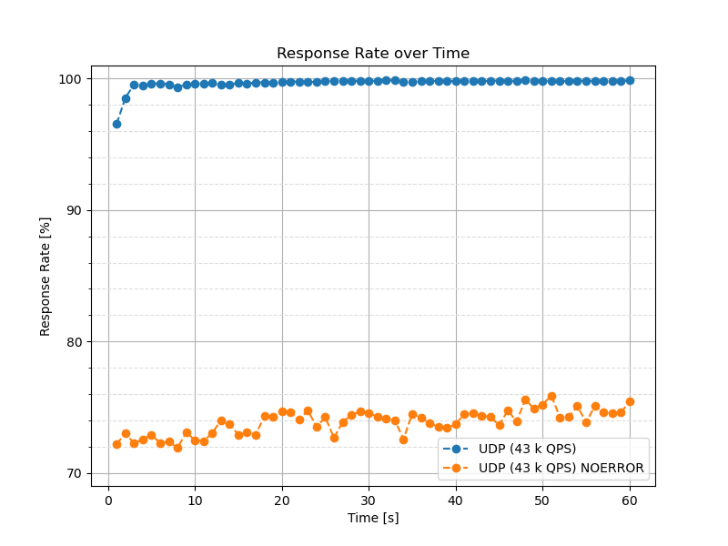

# Response Rate Chart

This basic chart can display the overall response rate over time. It is also
possible to plot specific error codes, such as `NOERROR`.

```
$ tools/plot-response-rate.py -r 0 -o rr.png UDP.json
```

!!! tip
    The image format depends on the output filename extension chosen with can
    `-o/--output`. `svg` is used by default, but other formats such as `png`
    are supported as well.

The following chart displays the answer rate and the rate of `NOERROR` answers.
In this measurement, the resolver was started with a cold cache. We can see the
overall response rate is close to 100 %. The `NOERROR` response rate slightly
increases over time from 72 % to around 75 % as the cache warms up.


